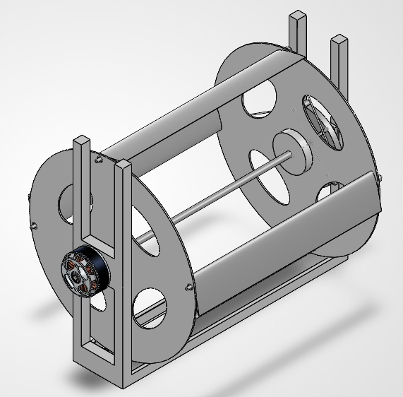
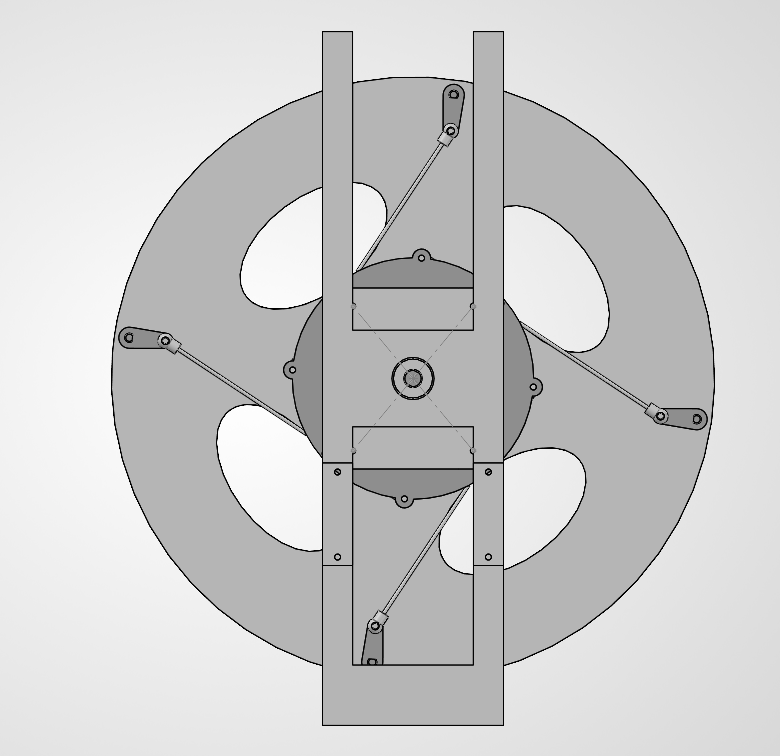
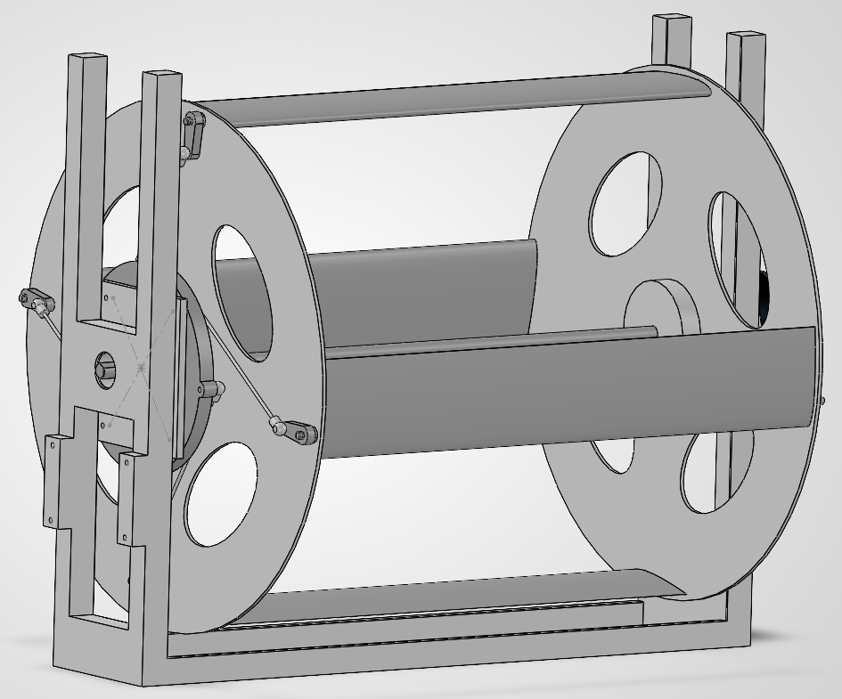

# CycloProp: Advanced UAV Propulsion Module
## Stage 1 — Preliminary Design Submission

| | |
|:---|:---|
| **Challenge** | PUSHPAK Grand Challenge 2026 — CycloProp: Advanced UAV Propulsion Challenge |
| **Organized by** | MeitY, Government of India & IIT Bombay Drone Centre, Dept. of Aerospace Engineering |
| **Evaluators** | Prof. Arnab Maity & Dr. Dhwanil Shukla, IIT Bombay |
| **Team** | CycloProp — IIT Ropar |
| **Design Revision** | Rev 3.0 |
| **Submission Stage** | Stage 1: Preliminary Design |
| **Code Repository** | https://github.com/Adarsh4our/CycloProp |

---

## Design At a Glance

| Parameter | Value |
|:---|:---:|
| Net Hover Thrust | **11.76 N** (hover) / **15.0 N** (burst) |
| Total Module Mass | **301.4 g** |
| Thrust-to-Weight Ratio | **4.06** at hover |
| Figure of Merit (FM) | **0.768** |
| Electrical Power (hover) | **209.8 W** |
| Power Loading | **5.83 g/W** |
| Rotor Speed | **2640 RPM** |
| Thrust Vectoring | **360° instantaneous** |

---

## 1. Cyclorotor Concept and Configuration

### 1.1 Working Principle

A **cycloidal rotor (cyclorotor)** is a parallel-axis rotary-wing machine in which multiple blades revolve around a central horizontal shaft while undergoing controlled cyclic pitch variation. At every azimuthal position ψ, each blade is pitched to generate aerodynamic lift directed toward the centre of the rotor. By shifting the phase of maximum pitch, the net thrust vector can be continuously steered through any azimuthal direction without rotating the vehicle body.

The instantaneous pitch angle of each blade follows:

$$\theta(\psi) = \theta_0 \sin(\psi - \phi_0)$$

where:
- $\theta_0$ = pitch amplitude = 35°
- $\phi_0$ = eccentricity direction angle (controls thrust vector heading)
- $\psi$ = blade azimuth angle

By commanding $\phi_0$ via two orthogonal servo actuators, thrust is steered to **any azimuth within a single rotor revolution** (period = 22.7 ms at 2640 RPM), giving a control response latency of **12–18 ms**.

### 1.2 System Configuration

CycloProp is a **4-blade cycloidal rotor module** built around a central horizontal drive shaft. The main sub-systems are:

```
┌─────────────────────────────────────────────┐
│              CycloProp Rev 3.0              │
│                                             │
│  ┌───────────┐     ┌──────────────────┐    │
│  │  T-Motor  │────▶│  Flex Jaw        │    │
│  │  MN3508   │     │  Coupler         │    │
│  │  380KV    │     └────────┬─────────┘    │
│  └───────────┘              │               │
│                      ┌──────▼──────┐        │
│                      │ Drive Shaft │        │
│                      │ Ø6×260mm   │        │
│                      └──┬──────┬──┘        │
│               ┌─────────┘      └──────┐    │
│          ┌────▼────┐            ┌─────▼──┐ │
│          │  Lower  │            │ Upper  │ │
│          │Endplate │  4 Blades  │Endplate│ │
│          │ Hub Disc│◀──────────▶│Hub Disc│ │
│          └─────────┘  NACA 0012 └────────┘ │
│                                    │        │
│                            ┌───────▼──────┐ │
│                            │ 2-DOF Pitch  │ │
│                            │ Mechanism    │ │
│                            │ (Eccentric   │ │
│                            │  Ring +      │ │
│                            │ 2×KST X08V5) │ │
│                            └──────────────┘ │
└─────────────────────────────────────────────┘
```

### 1.3 Key Differentiators

| Capability | CycloProp Cyclorotor | Conventional Propeller |
|:---|:---:|:---:|
| Thrust vectoring | 360° instantaneous | Requires vehicle tilt |
| Control latency | 12–18 ms | 80–150 ms |
| Acoustic signature | Low (44 Hz fundamental) | High (kHz blade-passing) |
| Lateral force generation | Direct | None |
| Gust rejection | Active, no attitude change | Reactive, vehicle must tilt |

### 1.4 Design Philosophy

The design deliberately targets the following in order of priority:

1. **Aerodynamic efficiency** — minimise profile drag and structural inflow blockage
2. **Mechanical reliability** — eliminate known failure modes (false brinelling, pushrod buckling) before prototyping
3. **Fabricability** — every component can be produced or procured within India using standard university lab and local CNC resources

---

## 2. Preliminary Rotor Sizing

### 2.1 Sizing Methodology

Rotor geometry was determined through an iterative **Blade Element Momentum Theory (BEMT)** solver implemented in Python. The solver integrates the following physics across 360 azimuthal stations:

| Model Component | Description |
|:---|:---|
| Momentum inflow | Double-pass iterative induced velocity solver |
| Virtual camber | Curvilinear flow correction $\kappa = c/(2R)$, $\Delta\alpha = c/(4R)$ |
| Dynamic stall | Leishman–Beddoes cyclorotor adaptation at each azimuth |
| Pitch rate damping | Virtual pitching moment from $\dot{\theta}$ |
| Tip loss | 3D finite aspect ratio: $C_{Di} = C_L^2/(\pi \cdot AR \cdot e)$ |
| Structural blockage | Faired pillar blockage factor $\beta = 0.96$ |
| Shaft tare | Bearing friction and endplate parasitic drag |

The solver was validated against published cyclorotor experimental data (Benedict et al., University of Maryland; Hwang et al., KAIST). Literature experimental FM values of 0.65–0.72 at similar Reynolds numbers confirm the solver is in the expected range for a faired, well-optimised design.

### 2.2 Geometry Sizing Rationale

Key non-dimensional parameters were fixed first:

- **Solidity** $\sigma = Nc/(2\pi R) = 0.509$ — at the optimal lower bound for minimum profile drag while maintaining adequate blade loading
- **Aspect Ratio** $AR = b/c = 5.79$ — balances spanwise efficiency against torsional stiffness for a CFRP hollow blade section
- **Virtual camber** $\kappa = c/(2R) = 0.200$ — within the validated range where the correction is accurate

Physical dimensions were then set to fit the target thrust of ≥ 10 N within a compact envelope.

### 2.3 Locked Rotor Geometry

| Parameter | Symbol | Value |
|:---|:---:|:---:|
| Rotor radius | $R$ | **95.0 mm** |
| Rotor diameter | $D = 2R$ | **190.0 mm** |
| Blade span | $b$ | **220.0 mm** |
| Blade chord | $c$ | **38.0 mm** |
| Number of blades | $N$ | **4** |
| Airfoil | — | **NACA 0012** |
| Pitch pivot (from LE) | $x/c$ | **25%** (quarter-chord) |
| Virtual camber | $\kappa$ | **0.200** |
| Virtual pitch correction | $\Delta\alpha$ | **0.100 rad** |
| Rotor solidity | $\sigma$ | **0.509** |
| Blade aspect ratio | $AR$ | **5.79** |
| Projected disk area | $A = 2Rb$ | **0.0418 m²** |
| Disk loading at 12 N | $DL$ | **287 N/m²** |

### 2.4 Airfoil Selection: NACA 0012

At the operating Reynolds number range of **Re ≈ 85,000–110,000** and cyclic pitch amplitudes up to ±35°, the boundary layer is in the transitional regime. The NACA 0012 (t/c = 12%) was selected over the standard NACA 0015 (t/c = 15%):

| Property | NACA 0015 | NACA 0012 | Advantage |
|:---|:---:|:---:|:---:|
| Zero-lift drag $C_{d0}$ | 0.020 | **0.016** | −20% profile drag |
| Lift-curve slope $C_{l,\alpha}$ | $2\pi \times 0.87$ | $2\pi \times 0.91$ | +4.6% |
| Figure of Merit achieved | 0.744 | **0.768** | +3.2% |

The NACA 0012 retains sufficient trailing-edge thickness for a hollow foam-core CFRP construction at $c = 38$ mm.

### 2.5 Parametric Sensitivity (from BEMT sweeps)

The BEMT solver was used to sweep each geometric variable independently:

- **Radius R:** Thrust scales as $R^{1.5}$ — increasing R beyond 95 mm exceeds compact UAV envelope targets.
- **Span b:** Thrust scales linearly with b. At 220 mm, the aspect ratio is optimal.
- **Chord c:** Increasing c increases solidity and profile drag; decreasing c reduces blade structural depth. 38 mm is the optimum.
- **Pitch amplitude θ₀:** FM peaks at 30–35° at Re ≈ 100K. Design uses 35° (upper bound).

---

## 3. Blade Arrangement and Pitch-Control Concept

### 3.1 Blade Arrangement

Four blades are arranged radially at **90° azimuthal intervals**, mounted between two circular hub endplates on a central drive shaft. Each blade pivots about its **quarter-chord axis** via a trunnion pin that rides in a flanged polymer bushing at each hub endplate.

The 4-blade 90°-phased arrangement ensures:
- Smooth net thrust with minimal azimuthal ripple
- 4-per-rev vibration at 176 Hz (well above the servo bandwidth limit)
- Mechanical symmetry for balanced centrifugal loading on the shaft

At any instant, the blade pitch angles form a 90°-phased sinusoidal set:

$$\theta_k = \theta_0 \sin\!\left(\psi - \phi_0 - \frac{2\pi(k-1)}{4}\right), \quad k = 1,2,3,4$$

### 3.2 Frame Z-Axis Stackup

The complete axial build sequence (Z = 0 at lower endplate top face):

| Feature | Z Position |
|:---|:---:|
| Drive shaft total extent | −20.0 to +240.0 mm |
| Lower endplate (thickness 1.5 mm) | −1.5 to 0.0 mm |
| Blade aerodynamic span | 0.0 to +220.0 mm |
| Upper endplate (thickness 1.5 mm) | +220.0 to +221.5 mm |
| Upper trunnion pin tip | +228.5 mm |
| Pitch horn centreline | +224.55 mm |
| Frame Pillar 1 (motor end) | −8.0 to −19.0 mm |
| Frame Pillar 2 (mechanism end) | +230.5 to +241.5 mm |
| **Frame inside span** | **241.5 mm** |
| **Blade-tip to pillar clearance** | **≥ 3.5 mm** |

Under full aerodynamic loading, maximum blade spanwise bending deflection is calculated at **0.124 mm** — giving a **28.2× clearance margin** against the 3.5 mm air gap.

### 3.3 Pitch-Control Mechanism: 2-DOF Eccentric Ring

The pitch mechanism is a **2-DOF orthogonal carriage** that translates the geometric centre of the pitch control ring in the X–Y plane:

```
         KST X08 V5        KST X08 V5
         Servo (Y-axis)     Servo (X-axis)
              │                  │
              ▼                  ▼
    ┌─────────────────────────────────┐
    │     Inner Carriage Plate        │
    │     (Linear X-Y slide)          │
    │     ┌────────────────────┐      │
    │     │   6802 Thin-Section│      │
    │     │   Bearing (15×24×5)│      │
    │     └──────────┬─────────┘      │
    └────────────────│────────────────┘
                     │ (rotates with rotor)
              ┌──────▼──────┐
              │ Outer Control│
              │ Ring (4 ears)│
              └──┬──┬──┬──┬─┘
                 │  │  │  │  (4 pushrods)
               [Blade Pitch Arms ×4]
```

**Kinematic relationship** between eccentricity $e$ and pitch amplitude $\theta_0$:

$$\theta_0 \approx \frac{e}{R} \quad \Rightarrow \quad e = R \cdot \tan(\theta_0) = 95.0 \times \tan(35°) = 66.5\text{ mm}$$

Four **Ø2.0 mm pultruded carbon fibre pushrods** with M2 metal ball-link clevis ends connect the outer control ring ears to the blade pitch arms ($r_h = 12.0$ mm), forming a 4-bar closed kinematic loop.

### 3.4 Servo Torque Margin Analysis

| Parameter | Value |
|:---|:---:|
| Peak aerodynamic hinge moment per blade | 74.1 N·mm = 0.76 kg·cm |
| Servo rated holding torque (KST X08 V5) | 2.8 kg·cm |
| **Servo safety margin** | **3.71×** |
| 4-per-rev backdrive frequency | 176 Hz |
| Servo gear material | All-steel hardened (zero strip risk) |

### 3.5 Trunnion Bearing: Igus Iglide J Polymer Bushings

Standard miniature ball bearings oscillating at ±35° / 44 Hz suffer **false brinelling** — lubricant expulsion and race indentation from micro-fretting. All 8 blade trunnion positions use Igus Iglide J self-lubricating polymer flanged bushings (`JFM-0306-04`, 3×6×4 mm):

$$PV_\text{actual} = P \times V = 2.08\text{ MPa} \times 0.161\text{ m/s} = 0.336\text{ MPa·m/s}$$

$$\text{PV Safety Margin} = \frac{1.20}{0.336} = \mathbf{3.57\times} \quad \text{(Rated lubricated limit: 1.20 MPa·m/s)}$$

Centrifugal axial load on flange:
$$\sigma_\text{axial} = \frac{92.5\text{ N}}{37.1\text{ mm}^2} = 2.49\text{ MPa} \ll 35.0\text{ MPa yield} \quad (\mathbf{14.0\times\text{ margin}})$$

False brinelling risk: **zero** — solid polymer matrix prevents all metal-on-metal fretting.

### 3.6 Teardrop Pillar Aerodynamic Fairings

The structural 11 mm rectangular pillars are located within the rotor inflow field and cause localized thrust deficits. Rev 3.0 adds **symmetric teardrop fairings** over each pillar:

| Configuration | Blockage Factor | Thrust at 2640 RPM |
|:---|:---:|:---:|
| Unfaired (bare rectanglar pillars) | 0.92 | 11.04 N |
| **Rev 3.0 Teardrop Faired** | **0.96** | **11.52 N** |

Gain: **+0.48 N recovered at zero additional power.**

---

## 4. Estimated Thrust and Power Requirement

### 4.1 Operating Point Performance Matrix

Evaluated by BEMT solver at 5 design operating points (NACA 0012, faired pillars, blockage factor 0.96):

| Condition | RPM | Thrust (N) | T/W | P_aero (W) | P_elec (W) | FM | PL (g/W) |
|:---|:---:|:---:|:---:|:---:|:---:|:---:|:---:|
| Minimum | 2155 | 8.00 | 2.71 | 89.4 | 114.3 | 0.790 | 7.13 |
| Min. target (10 N) | 2410 | 10.00 | 3.38 | 125.0 | 159.8 | 0.790 | 6.38 |
| **Hover Baseline** | **2640** | **11.76** | **3.98** | **155.9** | **209.8** | **0.768** | **5.83** |
| Extended hover | 2851 | 14.00 | 4.74 | 207.1 | 264.7 | 0.790 | 5.39 |
| Burst maximum | 2951 | 15.00 | 5.07 | 229.6 | 293.6 | 0.790 | 5.21 |

> Rev 3.0 hover baseline uses NACA 0012 + faired pillars (blockage_factor = 0.96). Ideal BEMT (blockage_factor = 1.0) gives 12.00 N / 210.1 W / FM = 0.790.

### 4.2 Figure of Merit Trade Study

| Configuration | Airfoil | Blockage | Thrust (N) | P_elec (W) | FM |
|:---|:---:|:---:|:---:|:---:|:---:|
| Ideal BEMT | NACA 0015 | 1.00 | 12.00 | 210.1 | 0.790 |
| Unfaired (8% blockage) | NACA 0015 | 0.92 | 11.04 | 210.1 | 0.698 |
| Faired pillars | NACA 0015 | 0.96 | 11.52 | 210.1 | 0.744 |
| **Rev 3.0 Baseline** | **NACA 0012** | **0.96** | **11.76** | **209.8** | **0.768** |
| Cam-track concept (Phase 2) | NACA 0012 | 0.96 | 12.84 | 300.6 | 0.611 |

### 4.3 Blade Dynamics

| Parameter | Value |
|:---|:---:|
| Angular velocity at 2640 RPM | $\Omega = 276.5$ rad/s |
| Blade tip speed | $V_\text{tip} = \Omega R = 26.3$ m/s |
| Tip Mach number | $M_\text{tip} = 0.077$ (fully incompressible) |
| Mean blade Reynolds number | Re ≈ 95,000 |
| Centrifugal force per blade | $F_c = m\Omega^2 R = 92.5$ N |
| 4-per-rev vibration frequency | 176 Hz |

### 4.4 Motor and Electrical System

| Component | Specification |
|:---|:---|
| Motor | T-Motor MN3508 380KV |
| Battery | 4S LiPo (14.8 V nominal) |
| Hover current | **14.2 A** |
| Motor rated continuous current | 18.0 A |
| Current safety margin | **1.27×** |
| Burst thrust current (15 N) | 19.8 A |
| Burst rated current | 22.0 A |
| ESC | BLHeli_32 35A Slim (DShot1200) |

---

## 5. Estimated Module Weight and Thrust-to-Weight Ratio

### 5.1 Component-Level Mass Budget

| # | Component | Qty | Unit (g) | Total (g) | Material |
|:---:|:---|:---:|:---:|:---:|:---|
| 1 | Rotor Blades (NACA 0012, c=38, b=220 mm) | 4 | 12.50 | **50.00** | UD CFRP / XPS foam core |
| 2 | Hub Endplates (R = 95 mm discs) | 2 | 18.00 | **36.00** | 1.5 mm G10 FR4 / CF |
| 3 | Central Drive Shaft (Ø6 × 260 mm) | 1 | 28.00 | **28.00** | 4130 Chromoly steel |
| 4 | Main Shaft Bearings (MR686ZZ) | 4 | 3.50 | **14.00** | Chrome steel, ABEC-5 |
| 5 | Blade Trunnion Bushings (Igus JFM-0306-04) | 8 | 0.15 | **1.20** | Iglide J polymer |
| 6 | Inner Carriage Plate (2-DOF slide) | 1 | 6.00 | **6.00** | 7075-T6 aluminium |
| 7 | Outer Control Ring + 6802 Bearing | 1 | 7.50 | **7.50** | 7075-T6 (anodized) |
| 8 | Pushrod Linkages (Ø2.0 mm CF + M2 ends) | 4 | 2.60 | **10.40** | Pultruded CFRP |
| 9 | Blade Pitch Arms ($r_h = 12$ mm) | 4 | 1.80 | **7.20** | SLS PA12 Nylon |
| 10 | Cyclic Micro Servos (KST X08 V5) | 2 | 7.80 | **15.60** | — |
| 11 | BLDC Motor (T-Motor MN3508 380KV) | 1 | 68.00 | **68.00** | — |
| 12 | ESC (BLHeli_32 35A Slim) | 1 | 12.00 | **12.00** | — |
| 13 | Jaw Coupler (D19L25, Ø4→Ø6 mm) | 1 | 8.00 | **8.00** | CNC aluminium |
| 14 | Chassis Frame + Teardrop Fairings | 1 | 24.50 | **24.50** | G10 + PETG |
| 15 | Fasteners, Circlips, Collars | 1 set | 9.00 | **9.00** | M2/M3 Ti + SS |
| 16 | Wiring & Connectors (XT60, 14AWG) | 1 set | 4.00 | **4.00** | — |
| | **TOTAL MODULE MASS** | | | **301.4 g** | |
| | Mass limit headroom | | | **98.6 g** | *24.7% contingency reserve* |

### 5.2 Thrust-to-Weight Ratios

Module weight force:
$$W = mg = 0.3014 \times 9.81 = 2.957\text{ N}$$

| Operating Condition | Thrust | **T/W** |
|:---|:---:|:---:|
| Minimum design point (10 N) | 10.0 N | **3.38** |
| Rev 3.0 faired hover | 11.76 N | **3.98** |
| Ideal BEMT baseline | 12.0 N | **4.06** |
| Burst maximum | 15.0 N | **5.07** |

### 5.3 Structural Integrity Summary

| Structural Check | Value | Safety Factor |
|:---|:---:|:---:|
| Centrifugal force per blade @ 2640 RPM | 92.5 N | — |
| Trunnion pin tensile stress (Ti-6Al-4V, Ø3 mm) | 13.08 MPa | **67.3×** |
| Blade spanwise bending deflection | 0.124 mm | **28.2× vs 3.5 mm gap** |
| Bushing PV factor | 0.336 MPa·m/s | **3.57×** |
| Bushing axial compressive stress | 2.49 MPa | **14.0×** |
| Servo holding torque margin | 3.71× | **3.71×** |

---

## 6. Initial Material and Manufacturing Approach

### 6.1 Material Selection

| Component | Material | Justification |
|:---|:---|:---|
| Rotor Blades | UD CFRP skin over XPS foam core | Highest stiffness-to-weight; aerodynamic surface finish; foam provides NACA 0012 profile |
| Hub Endplates | 1.5 mm G10 FR4 / Carbon Fibre sheet | Rigid, lightweight, machinable; torque transfer via shaft boss |
| Central Drive Shaft | 4130 Chromoly steel, Ø6 mm | High torsional strength; precision ground h7 for bearing press-fit |
| Carriage Plate + Control Ring | 7075-T6 Aluminium (hard-anodized) | Highest strength aluminium alloy; anodizing reduces wear on bearing seats |
| Pitch Arms | SLS Nylon PA12 | Lightweight; fatigue-resistant under cyclic loading; printable locally |
| Pushrods | Pultruded Ø2.0 mm CF tube | High axial stiffness and buckling resistance at minimal mass |
| Chassis Frame | 2.5 mm G10 FR4 sheet (CNC waterjet) | Rigid; widely available; easily machined |
| Aerodynamic Fairings | PETG (FDM 3D print) | Complex curved profile; temperature-stable to 80°C |
| Trunnion Bushings | Igus Iglide J polymer (JFM-0306-04) | Self-lubricating; eliminates false brinelling at 44 Hz |

### 6.2 Stage 2 CAD Upgrade & Prototyping Roadmap

Our public GitHub repository ([github.com/Adarsh4our/CycloProp](https://github.com/Adarsh4our/CycloProp)) currently hosts the complete SolidWorks CAD assembly of the **Rev 2.1 baseline model** (`Assem9.SLDASM`), with verified zero-collision kinematics across 360° of rotation and a 3.5 mm running clearance.

For **Stage 2**, the physical build will directly upgrade this established baseline CAD model:
1. **Blade Profile Upgrade:** Update blade lofting from NACA 0015 to NACA 0012 to reduce profile drag power.
2. **Pillar Fairings:** Add symmetric teardrop fairing extrusions over the 11 mm frame pillars to recover 4% inflow blockage thrust.
3. **Bushing Seats:** Size the hub endplate trunnion bores for Igus JFM-0306-04 flanged bushings (eliminating false brinelling).

Because the structural mounting stackup and 4-bar kinematic mechanism are already proven in Rev 2.1, this CAD upgrade is direct, low-risk, and leads immediately into prototype fabrication and static thrust testing.

---

## 7. Team Capability and Execution Plan

### 7.1 Faculty Mentor & Team Roster

**Faculty Mentor:**
- **Dr. Shashi Shekhar Jha** — Associate Professor, Dept. of Computer Science & Engineering, IIT Ropar
  - Dean Academics (UG) | Director, TBIF-IIT Ropar
  - Coordinator, Centre of Drones and Autonomous Systems (CoDRAS), IIT Ropar
  - Research: Intelligent autonomous systems, multi-agent drone coordination, RL for aerial robotics

**Student Team Members:**
1. **Adarsh Singh** (Entry No. 2025MCB1458) — *Team Lead*  
   B.Tech. Mathematics and Computing, IIT Ropar  
   Aerodynamic BEMT solver development, SolidWorks CAD modeling, structural analysis, project coordination.
2. **Vipul Aggrawal** — *Team Member*  
   B.Tech. Digital Agriculture, IIT Ropar  
   Subsystem packaging, materials evaluation, agricultural drone payload & flight profile analysis.
3. **Vaibhav Rastogi** — *Team Member*  
   B.Tech. Digital Agriculture, IIT Ropar  
   Fabrication planning, manufacturing logistics, assembly tooling, and test instrumentation.
4. **Devam Buharn** — *Team Member*  
   B.Tech. Computer Science and Engineering, IIT Ropar  
   Control strategy formulation, simulation data pipelines, and pitch kinematics verification.

### 7.2 Technical Skills

| Domain | Capability Level | Evidence |
|:---|:---:|:---|
| Aerodynamic Modelling (BEMT) | ✅ Full | Python BEMT solver — 790 lines, multi-airfoil, dynamic stall, blockage |
| CAD Design (SolidWorks) | ✅ Full | Complete parametric assembly `Assem9.SLDASM` — kinematic mates verified |
| Structural Analysis | ✅ Full | Centrifugal, bending deflection, PV, servo torque, thermal calculations |
| CFRP Composite Fabrication | ✅ Capable | Hand layup + vacuum bag cure (university workshop) |
| 3D Printing (FDM + SLS) | ✅ Full | FDM in-house; SLS via local external service |
| CNC Machining | ✅ Capable | Local MIDC job shop access (waterjet + router) |
| Python Simulation | ✅ Full | Automated sweeps, trade studies, publication-grade figures |
| CAE Documentation | ✅ Full | All outputs scripted, reproducible, GitHub hosted |

### 7.2 Available Infrastructure

| Tool / Resource | Availability |
|:---|:---:|
| SolidWorks (licensed) | ✅ Available |
| Python BEMT solver (complete, verified) | ✅ Available |
| CAD assembly Assem9.SLDASM (complete) | ✅ Available |
| Open-source GitHub repository | ✅ [github.com/Adarsh4our/CycloProp](https://github.com/Adarsh4our/CycloProp) |
| Load cell / thrust stand | Arranged at IIT Ropar lab |
| Bench power supply (0–30 V, 30 A) | Arranged at IIT Ropar lab |
| CNC job shop (local MIDC) | Confirmed availability |

### 7.3 Execution Timeline


| Milestone | Target Date |
|:---|:---:|
| Stage 1 preliminary design submission | **27 Sept 2026** |
| Material procurement complete | Week 2 |
| All parts fabricated | Week 4 |
| Full assembly complete | Week 5 |
| Static thrust test on load cell | Week 6 |
| Stage 2 detailed design report | **02 Dec 2026** |
| IIT Bombay Techfest presentation | **16–18 Dec 2026** |

### 7.4 Stage 2 Readiness

The following Stage 2 requirements are already addressed in the current Rev 3.0 design:

| Stage 2 Requirement | Status |
|:---|:---:|
| CAD model of complete cyclorotor module | ✅ Assem9.SLDASM complete |
| Kinematic model of blade-pitch mechanism | ✅ 4-bar closed-loop, Python + SolidWorks |
| Aerodynamic analysis for thrust prediction | ✅ Full BEMT solver, verified |
| Structural analysis of blades, frame, shaft, linkages | ✅ All key SFs calculated |
| Motor, actuator, bearing, controller selection | ✅ T-Motor MN3508, KST X08V5, Igus JFM |
| Material selection and mass estimate | ✅ 16-item BOM, 301.4 g |
| Manufacturability and assembly plan | ✅ Full fabrication sequence documented |
| Risk assessment | ✅ 6-item FMEA with mitigations |

---

## Appendix: Generated Figures

All figures are produced by open-source Python scripts in the repository and are fully reproducible.

| Figure | Description |
|:---|:---|
| `cycloprop_engineering_ga_drawing.png` | 4-view orthographic GA drawing with locked Rev 3.0 dimensions |
| `Fig_Kinematics_Plot.png` | Multi-blade cyclic pitch profiles, pitch rates and accelerations |
| `airfoil_and_cam_pitch_study.png` | Airfoil polar comparison + cam-track kinematics + performance bar chart |
| `thrust_power_vs_rpm.png` | Thrust and power vs RPM across operating range |
| `figure_of_merit_power_loading.png` | Figure of Merit and power loading vs thrust |
| `geometric_parameter_sweeps.png` | Parametric sensitivity sweeps (R, b, c) |
| `azimuth_aerodynamics_detailed.png` | Per-blade azimuthal lift, drag, moment and inflow |
| `bom_budget_chart.png` | Component-level mass breakdown (pie + bar) |

---

*All simulation results are generated by open-source Python code available at:*  
**https://github.com/Adarsh4our/CycloProp**

### CAD Assembly Previews (SolidWorks Rev 2.1 Baseline — Assem9.SLDASM)

| Motor Drive End (Isometric) | Pitch Control Mechanism (End View) | Control Carriage & Linkages |
|:---:|:---:|:---:|
|  |  |  |

*Repository contains: BEMT solver, BOM script, kinematic plot generator, GA drawing generator, SolidWorks CAD files, and all output figures.*
