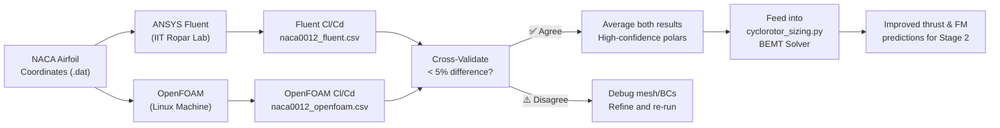

# CycloProp — ANSYS Fluent 2D Airfoil CFD Guide
## 5 Airfoil Study at Re = 95,000 | IIT Ropar Academic License

> [!IMPORTANT]
> **Run this at IIT Ropar lab or via VPN with ANSYS Academic license.**
> At the end, cross-validate results against OpenFOAM (Linux) to confirm accuracy.

---

## Why Both OpenFOAM + ANSYS?

| | OpenFOAM (Linux) | ANSYS Fluent (IIT Lab) |
|:---|:---|:---|
| **Purpose** | Primary CFD run | Cross-validation |
| **Interface** | Terminal (manual) | GUI (visual) |
| **Result format** | CSV (auto-scripted) | Report file (Fluent) |
| **Trust level** | Industry-standard | Industry-standard |
| **If both agree** ✅ | → Results are **confirmed valid** |  |
| **If they disagree** ⚠️ | → Check mesh quality, boundary conditions |  |

---

## Operating Conditions (Same as OpenFOAM)

| Parameter | Value |
|:---|:---:|
| Chord | c = 38 mm = 0.038 m |
| Inlet velocity | V = **36.8 m/s** |
| Reynolds number | Re = **95,000** |
| Turbulence model | **k-ω SST** |
| Flow type | Incompressible steady RANS |
| AoA range | **−35° to +35°** in 5° steps |
| Airfoils | NACA 0009, 0012, 0015, 0018, 63-012 |

---

## PHASE 1 — Get Airfoil Geometry (NACA Coordinates)

### Option A: Use Python to generate DAT files (run on Windows)

```python
# Run this on your Windows machine, then carry the .dat files to the ANSYS lab
import numpy as np

def naca_4digit(t, n=200):
    beta = np.linspace(0, np.pi, n)
    x = 0.5 * (1 - np.cos(beta))
    yt = (t/0.2) * (0.2969*np.sqrt(x) - 0.1260*x
                   - 0.3516*x**2 + 0.2843*x**3 - 0.1015*x**4)
    coords = list(zip(x, yt)) + list(zip(x[::-1], -yt[::-1]))
    return np.array(coords)

airfoils = {
    "NACA0009": naca_4digit(0.09),
    "NACA0012": naca_4digit(0.12),
    "NACA0015": naca_4digit(0.15),
    "NACA0018": naca_4digit(0.18),
}

for name, coords in airfoils.items():
    # Scale to actual chord = 38 mm
    coords_mm = coords * 38.0
    np.savetxt(f"{name}_38mm.dat", coords_mm, fmt="%.5f",
               header=f"{name} airfoil, chord=38mm, for ANSYS import")
    print(f"Saved {name}_38mm.dat")
```

### Option B: Download directly from UIUC Airfoil Database

1. Go to: **https://m-selig.ae.illinois.edu/ads/coord_database.html**
2. Search: `naca0012`, `naca0015`, `naca0018`, `naca0009`, `naca63012`
3. Download `.dat` files for each
4. Scale coordinates to 38 mm chord in a text editor or Excel

---

## PHASE 2 — Launch ANSYS Workbench

1. Open **ANSYS Workbench 2023/2024** (from Start menu or IIT VPN portal)
2. From the toolbox on the left, drag **"Fluid Flow (Fluent)"** onto the Project Schematic
3. You'll see a 5-step pipeline appear:

```
[Geometry] → [Mesh] → [Setup] → [Solution] → [Results]
```

We'll work through each step.

---

## PHASE 3 — Create Geometry in SpaceClaim / DesignModeler

### 3a. Open Geometry Cell
Double-click **"Geometry"** in the pipeline → ANSYS SpaceClaim opens

### 3b. Create the Fluid Domain (C-Grid)

The fluid domain is a large C-shaped region around the airfoil:

```
         ┌─────────────────────────────────────┐
         │                                     │
         │         Far-field boundary          │
         │   (15× chord = 570 mm radius)       │
         │                                     │
         │      ┌──────────┐                   │
Far-      │      │  NACA    │     Wake          │
field ────│──────│ Airfoil  │──────────────────│────→
         │      │ (38mm    │    (30 × chord)   │
         │      │  chord)  │                   │
         │      └──────────┘                   │
         │                                     │
         └─────────────────────────────────────┘
```

**Domain dimensions:**
- Upstream / sides: **15c = 570 mm** from airfoil
- Downstream (wake): **30c = 1140 mm** from trailing edge
- Span (2D): **1 mm** (unit span — Fluent will handle per-unit-span)

### 3c. Import Airfoil Coordinates

1. In SpaceClaim: **File → Import** → select your `NACA0012_38mm.dat`
2. Or: **Sketch → Spline** → manually paste coordinates
3. Create a closed surface: **Pull** the 2D profile to 1 mm depth (for 2D pseudo-3D)
4. Create outer domain: Draw a semicircle (radius 570 mm) + rectangle (wake)
5. **Boolean subtract** the airfoil from the outer domain → fluid region only

> **Tip:** If SpaceClaim struggles with the spline import, use **DesignModeler** instead:
> File → New DesignModeler → Concept → 3D Curve → paste coordinates

---

## PHASE 4 — Mesh in ANSYS Meshing

Double-click **"Mesh"** cell → ANSYS Meshing opens

### 4a. Mesh Strategy: Structured O-grid around airfoil

This gives the best accuracy for airfoil boundary layers:

**Settings to apply:**

| Location | Setting | Value |
|:---|:---|:---|
| **Global Mesh** | Element size | 5 mm (coarse background) |
| **Airfoil surface** | Element size | 0.3 mm (fine near wall) |
| **Inflation layers** | First layer thickness | **0.002 mm** |
| **Inflation layers** | Growth rate | 1.15 |
| **Inflation layers** | Number of layers | **20** |
| **Wake region** | Refinement | 1 mm element size |

### 4b. First Layer Thickness Calculation

For k-ω SST to work properly, the **first cell height** must be small enough:

$$y^+ = \frac{y_1 \cdot u_\tau}{\nu} \approx 1 \quad \Rightarrow \quad y_1 = \frac{\nu}{u_\tau}$$

For Re = 95,000:
$$u_\tau \approx 0.04 \times V = 0.04 \times 36.8 = 1.47 \text{ m/s}$$
$$y_1 = \frac{1.477 \times 10^{-5}}{1.47} = \mathbf{0.010 \text{ mm}} \quad (\text{use } 0.005\text{ mm to be safe})$$

**Set first inflation layer to: `0.005 mm`**

### 4c. Named Selections (Critical!)

Create these named selections — Fluent uses them for boundary conditions:

| Region | Name to assign |
|:---|:---|
| Airfoil surface | `airfoil_wall` |
| Inlet (semicircle left + top + bottom) | `inlet` |
| Outlet (right face of wake) | `outlet` |
| Side faces (2D span) | `symmetry` (or `front` + `back`) |

Right-click each surface → **Insert Named Selection** → type the name.

### 4d. Generate and Check Mesh

Click **Generate** → then check:
- **Statistics** → Target: Total cells < 300,000 (academic limit is 512K)
- **Quality** → Orthogonal Quality should be > 0.1 (higher = better)
- **Skewness** → Should be < 0.9

---

## PHASE 5 — Fluent Setup (Most Important Phase)

Double-click **"Setup"** → ANSYS Fluent launches

### 5a. General Settings
- **Solver type:** Pressure-Based
- **Velocity formulation:** Absolute
- **Time:** Steady

### 5b. Models
- **Viscous Model:** k-omega SST ✅
  - `Turbulence` → `k-omega (2 eqn)` → **SST**
  - Enable: **Low-Re Corrections** (important for Re~95K!)
  - Enable: **Production Limiter**

### 5c. Materials
- **Fluid:** Air
  - Density: 1.225 kg/m³
  - Viscosity: 1.81×10⁻⁵ Pa·s (dynamic) → kinematic ν = 1.477×10⁻⁵ m²/s

### 5d. Boundary Conditions

#### For α = 0° (pure horizontal flow, V = 36.8 m/s):

| Boundary | Type | Settings |
|:---|:---|:---|
| `inlet` | Velocity Inlet | X-velocity: 36.8 m/s, Y-velocity: 0 |
| `outlet` | Pressure Outlet | Gauge pressure: 0 Pa |
| `airfoil_wall` | Wall | No-slip (default) |
| `symmetry` | Symmetry | — |

**Turbulence at inlet:**
- Turbulence Intensity: **1%** (low, representative of clean flow)
- Turbulent Viscosity Ratio: **10**

#### For α = 10° (V = 36.8 m/s at 10° angle):
- X-velocity: **36.23 m/s**
- Y-velocity: **6.39 m/s**

> [!TIP]
> **Faster method:** Instead of changing velocity direction, rotate the **airfoil geometry** by −α in SpaceClaim and keep the flow horizontal. This avoids re-meshing but needs a new geometry per angle.
>
> **Even faster:** Keep the geometry fixed, just change Vx and Vy in the inlet boundary condition. Requires re-running Fluent only — no re-meshing!

### 5e. Reference Values (Critical for Cl/Cd)

Go to **Reference Values** and set:
| Parameter | Value |
|:---|:---|
| Area | **0.038 m²** (chord × 1 m unit span) |
| Density | 1.225 kg/m³ |
| Velocity | 36.8 m/s |
| Length | 0.038 m (chord) |

### 5f. Report Definitions — Automatic Cl/Cd Tracking

1. **Report Definitions** → New → **Force Report → Lift**
   - Name: `Cl`
   - Force Vector: **perpendicular to flow** → (−sin α, cos α, 0)
   - Zone: `airfoil_wall`
   
2. **Report Definitions** → New → **Force Report → Drag**
   - Name: `Cd`
   - Force Vector: **parallel to flow** → (cos α, sin α, 0)
   - Zone: `airfoil_wall`

3. **Monitors → Report Plot** → add Cl and Cd → they will live-plot during iteration

### 5g. Solution Methods
| Setting | Value |
|:---|:---|
| Scheme | SIMPLE |
| Gradient | Least Squares Cell Based |
| Pressure | Second Order |
| Momentum | Second Order Upwind |
| Turbulence (k, ω) | Second Order Upwind |

### 5h. Relaxation Factors (for stability at low Re)
| Variable | Factor |
|:---|:---:|
| Pressure | 0.3 |
| Momentum | 0.5 |
| k, omega | 0.5 |
| Turbulent Viscosity | 0.8 |

---

## PHASE 6 — Run the Simulation

1. **Initialization** → Hybrid Initialization → **Initialize**
2. **Run Calculation** → Number of Iterations: **500**
3. Click **Calculate**

**Watch the residuals panel:**
- Continuity, x-velocity, y-velocity, k, omega should all drop below **1×10⁻⁵**
- Cl and Cd plots should flatten and stabilize

**Typical runtime:** 2–5 minutes per angle on a modern workstation.

---

## PHASE 7 — Extract Cl and Cd Results

### Method 1: Report Definitions (easiest)
- After convergence: **Reports** → **Force Reports** → **Lift / Drag**
- Select zone: `airfoil_wall`
- Click **Compute** → Fluent prints Cl and Cd

### Method 2: Export to file
- **File → Export → Solution Data** → select Cl, Cd, Cm → export as CSV

### Method 3: Journal file (automate across all angles)
Fluent supports scripting via **Scheme journal files** (.jou):

```scheme
; fluent_polar_sweep.jou
; Runs α = -35° to +35° automatically

(define V 36.8)
(define angles '(-35 -30 -25 -20 -15 -10 -5 0 5 10 15 20 25 30 35))

(for-each
  (lambda (alpha)
    (let* ((alpha-rad (* alpha (/ 3.14159 180)))
           (Vx (* V (cos alpha-rad)))
           (Vy (* V (sin alpha-rad))))
      ; Set velocity
      (ti-menu-load-string
        (format #f "bc vi inlet () vmag no ~a no ~a no 0 no 1 no 10 yes\n"
                Vx Vy))
      ; Run 300 iterations
      (ti-menu-load-string "it 300\n")
      ; Print Cl Cd
      (ti-menu-load-string "report lift-drag-moment () no airfoil_wall () yes no no\n")
    ))
  angles)
```

**To run a journal:**
- Fluent → **File → Read → Journal** → select `.jou` file

---

## PHASE 8 — Repeat for All 5 Airfoils

For each airfoil, the workflow is:
1. Import new geometry (new `.dat` file)
2. Re-mesh (or reuse mesh template — adjust spline only)
3. Re-run Fluent (boundary conditions stay the same)
4. Export Cl/Cd table

> [!TIP]
> Save each Fluent case as a `.cas.h5` file with a clear name:
> `NACA0012_Re95k.cas.h5`, `NACA0018_Re95k.cas.h5`, etc.

---

## PHASE 9 — Cross-Validation vs OpenFOAM

Once both sets of results are ready, compare:

| α (°) | OpenFOAM Cl | Fluent Cl | Diff % | OpenFOAM Cd | Fluent Cd | Diff % |
|:---:|:---:|:---:|:---:|:---:|:---:|:---:|
| 0 | — | — | — | — | — | — |
| 5 | — | — | — | — | — | — |
| 10 | — | — | — | — | — | — |
| 15 | — | — | — | — | — | — |
| 20 | — | — | — | — | — | — |

**Acceptable agreement:** < 5% difference in Cl, < 10% in Cd

If agreement is good → use **average of both** for BEMT integration (most conservative, defensible in competition report).

If disagreement > 10% → check:
1. Are mesh y+ values the same? (target y+ ≈ 1)
2. Same turbulence intensity at inlet?
3. Same reference area used for normalisation?

---

## PHASE 10 — Export for BEMT Integration

From Fluent: **File → Export → ASCII** with columns: `alpha, Cl, Cd, Cm`

Target output format:
```csv
alpha_deg,Cl,Cd,Cm
-35,-1.142,0.312,-0.045
-30,-1.018,0.218,-0.038
...
+35,+1.142,0.312,+0.045
```

Save as:
```
naca0012_fluent_Re95k.csv
naca0015_fluent_Re95k.csv
naca0018_fluent_Re95k.csv
naca0009_fluent_Re95k.csv
naca63012_fluent_Re95k.csv
```

Copy to: `C:\Users\Adarsh Singh\CycloProp\cfd_polars\`

---

## Summary: Fluent vs OpenFOAM Workflow Comparison



---

## ANSYS Quick-Start Checklist

```
□ Open ANSYS Workbench
□ Drag "Fluid Flow (Fluent)" onto schematic
□ Import airfoil .dat file in SpaceClaim
□ Build C-domain (15c upstream, 30c downstream)
□ Mesh with inflation layers (first layer 0.005 mm, 20 layers)
□ Create named selections: inlet, outlet, airfoil_wall, symmetry
□ Fluent → k-ω SST + Low-Re corrections
□ Set Reference Values: Area=0.038, Vel=36.8, L=0.038
□ Add Report Definitions for Cl and Cd
□ Initialize → Run 500 iterations
□ Converged when residuals < 1e-5
□ Export Cl, Cd to CSV
□ Repeat for each angle (just change Vx, Vy in inlet BC)
□ Repeat for each airfoil (re-import geometry + re-mesh)
□ Compare with OpenFOAM results
□ Export final averaged polars for BEMT integration
```

---

*CycloProp | PUSHPAK Grand Challenge 2026 | IIT Ropar*
*ANSYS Fluent guide — for use at IIT lab (academic license)*
